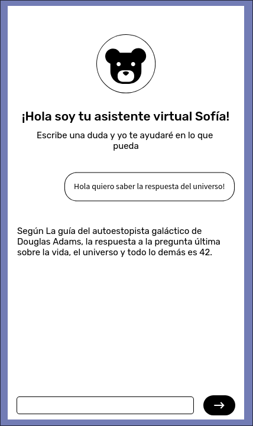
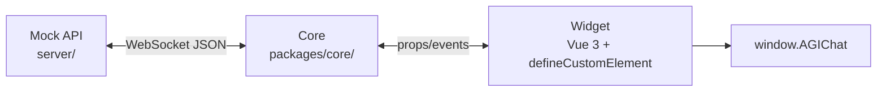

# AGIChat

AGIChat es un SDK de widget de chat embebible para clientes de la startup AGIChat.
La primera fase del proyecto busca construir una experiencia visual alineada al wireframe
de referencia, con una arquitectura preparada para sustituir el mock por un agente real
sin rehacer la interfaz.

## Contexto

La propuesta inicial del proyecto es resolver estos puntos:

- Crear un widget de chat que pueda incrustarse fácilmente en productos de terceros.
- Separar el backend simulado, la lógica de chat y la UI para permitir trabajo paralelo.
- Mantener el contrato de mensajes estable para no romper el cambio entre mock API y agente real.
- Renderizar respuestas en Markdown de forma segura desde la UI.
- Soportar un flujo de desarrollo con GitHub Flow, PRs, CI/CD y cobertura mínima del 80%.

## Wireframe

La interfaz base del widget debe seguir el wireframe entregado por la propuesta inicial.
La imagen de referencia está versionada dentro del repo para que el equipo la tenga a mano:



La paleta, tipografía y estilo visual pueden cambiar, pero los flujos y estados de UX deben
respetar esta referencia salvo que el equipo acuerde una modificación explícita.

## Arquitectura



- `server/` contiene el mock API con Elysia + Bun y valida el contrato WebSocket.
- `packages/core/` contiene el composable `useChat`, el estado de dominio y el transporte.
- `widget/` contiene la UI Vue 3, el montaje como Custom Element y la API pública `window.AGIChat`.

## Estructura del monorepo

```text
server/
  src/
    schemas/        # TypeBox y tipos del protocolo WebSocket
    handlers/       # lógica del mock API
packages/
  core/
    src/
      composables/  # useChat y conexión WebSocket
      types/        # estado y tipos del dominio
      services/     # adaptadores de transporte, si hacen falta
widget/
  src/
    components/     # componentes visuales del widget
    composables/    # comportamiento estrictamente visual
    styles/         # estilos del widget
docs/               # notas de arquitectura y decisiones
  images/           # recursos visuales de referencia, como el wireframe
```

## Contratos importantes

- [`CONTRACTS.md`](./CONTRACTS.md) define el contrato entre Mock API, Core y UI.
- [`AGENTS.md`](./AGENTS.md) define reglas de colaboración, estructura y límites por capa.

## Comandos

Desde la raíz del repositorio:

```bash
bun install
bun run lint
bun run typecheck
bun run test:coverage
bun run build
```

La CI aplica un gate mínimo de 80% para líneas, funciones y ramas a partir del reporte
LCOV generado por Bun. Los helpers compartidos de pruebas viven en `test/helpers/`.

Comandos útiles por paquete:

```bash
bun --cwd server dev
bun --cwd widget dev
bun --cwd widget test:unit
```

## Notas

- El frontend actual está implementado en `widget/` como base del SDK público.
- `packages/core/` es la capa compartida donde debe vivir la lógica del chat.
- El objetivo de esta fase es tener el widget listo para conectar un agente real sin cambiar el contrato.
