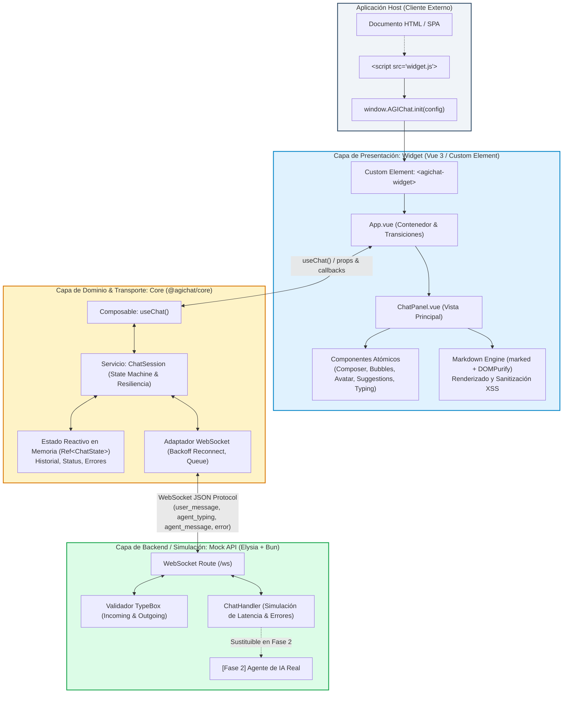
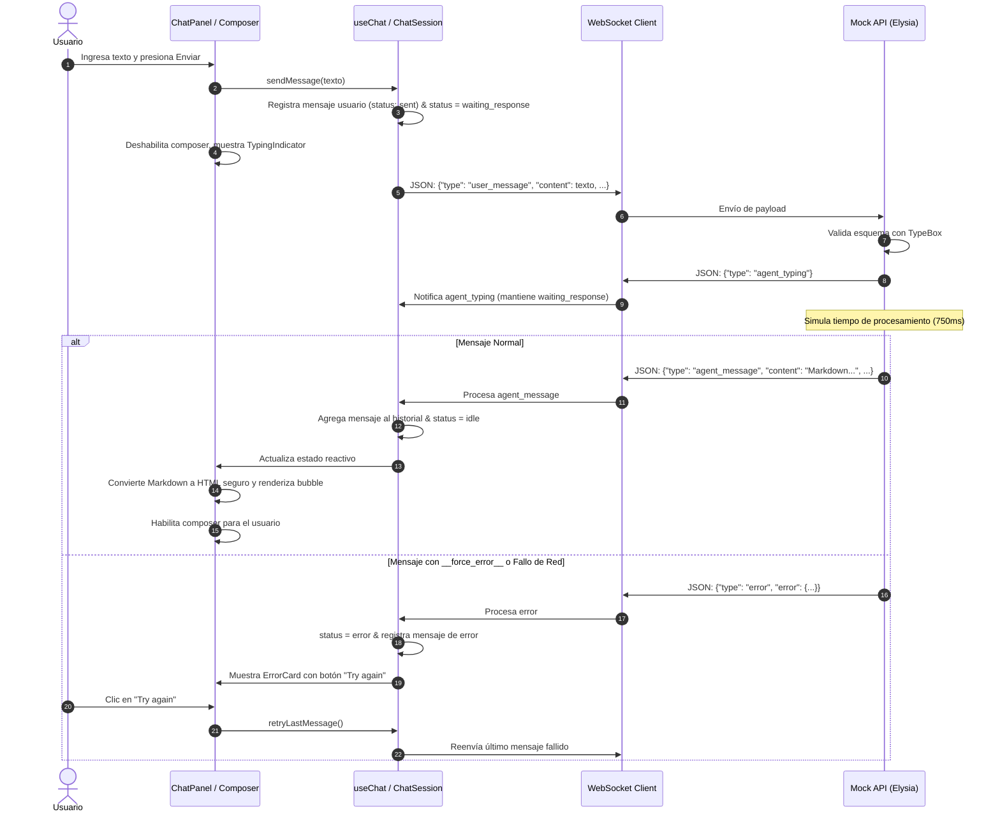

# Arquitectura del Sistema AGIChat

Este documento detalla la arquitectura de software del SDK de widget de chat de **AGIChat**, justificando las decisiones de diseño adoptadas y proporcionando una guía integral para que nuevos desarrolladores escalen el proyecto de manera ordenada, predecible y desacoplada.

---

## 1. Diagrama de Alto Nivel (Mermaid.js)

El sistema está diseñado en una **arquitectura por capas desacopladas (3 tiers)** que separa la simulación/agente de backend, la lógica de estado y dominio, y la capa de presentación visual.



### 1.1 Diagrama de Secuencia del Ciclo de Vida del Mensaje



---

## 2. Justificación de la Arquitectura Elegida

La arquitectura de AGIChat fue diseñada con los siguientes principios y justificaciones técnicas:

### 2.1 Desacoplamiento Estricto en 3 Capas
1. **Mock API (`server/`)**: Construido con **Elysia.js y TypeBox**. Se enfoca exclusivamente en recibir y emitir eventos mediante el protocolo WebSocket definido en `CONTRACTS.md`. Es un servidor sin estado (*stateless*).
   - *Justificación*: Al aislar el servidor como una entidad independiente del cliente, garantizamos que en la **Fase 2** el mock pueda ser reemplazado al 100% por un agente de IA generativa real (LLM, LangChain, Agente autónomo) sin requerir modificaciones ni en el Core ni en los componentes de la interfaz de usuario.
2. **Core (`packages/core/`)**: Paquete TypeScript puro que exporta el composable `useChat` y el motor `ChatSession`.
   - *Justificación*: Centraliza la máquina de estados del chat, la conexión WebSocket, el manejo de reconexiones con retroceso exponencial (*exponential backoff*), la cola de mensajes mientras conecta y la lógica de reintentos (`retryLastMessage()`). Al ser agnóstico del DOM y de la renderización HTML, puede ser reutilizado en cualquier aplicación web, CLI o móvil en el futuro.
3. **Widget (`widget/`)**: Implementado en Vue 3 y empaquetado como **Web Component** estándar (`defineCustomElement`) junto con la API global `window.AGIChat`.
   - *Justificación*: Permite que cualquier cliente externo de Maxine integre el widget en su plataforma mediante una etiqueta `<script>` y un simple `AGIChat.init({ containerId: '...', apiUrl: '...' })`, aislando los estilos mediante Shadow DOM o clases BEM contenidas para evitar colisiones con el CSS del cliente.

### 2.2 Seguridad y Renderizado de Markdown
- El agente emite Markdown crudo. La UI procesa dicho texto mediante `marked` y lo sanea estrictamente con `DOMPurify` antes de inyectarlo en el DOM.
- *Justificación*: Protege a los usuarios y clientes contra inyecciones XSS maliciosas que pudieran provenir de un agente comprometido o de contenido inyectado por terceros.

### 2.3 Resiliencia y Manejo de Errores Determinista
- El servidor mock implementa la bandera `__force_error__` para simular fallos predecibles en pruebas automatizadas y manuales.
- El Core implementa hasta 3 reintentos automáticos ante pérdida de socket y expone estados legibles (`waiting_response`, `error`) con recuperación interactiva.

---

## 3. Estructura de Directorios del Monorepo

El monorepo está organizado utilizando workspaces de Bun:

```text
.
├── .github/
│   └── workflows/
│       ├── ci.yml            # Pipeline CI: lint, typecheck, coverage >=80%, build
│       └── release.yml       # Pipeline CD: publicación automatizada por tags
├── docs/                     # Documentación de arquitectura y diseño
│   ├── images/
│   │   ├── wireframe.png     # Wireframe de referencia UX
│   │   └── widget-preview.png # Captura de la interfaz final implementada
│   └── architecture.md       # Este documento de arquitectura
├── packages/
│   └── core/                 # Lógica de dominio y composable agnóstico
│       ├── src/
│       │   ├── composables/  # useChat.ts (interfaz pública de reactividad)
│       │   ├── services/     # chatSession.ts (transporte WS, colas, backoff)
│       │   ├── types/        # chat.ts (contratos y estados de TypeScript)
│       │   └── index.ts      # Punto de entrada y exportaciones públicas
│       ├── tests/            # Pruebas unitarias de máquina de estado y sesión
│       └── package.json
├── server/                   # Mock API WebSocket en Elysia.js
│   ├── src/
│   │   ├── handlers/         # chat.handler.ts (lógica de simulación y latencia)
│   │   ├── schemas/          # chat.schema.ts (esquemas TypeBox y validaciones)
│   │   └── index.ts          # Servidor Elysia y endpoint WS /ws
│   ├── tests/                # Pruebas del handler y validación de esquemas
│   └── package.json
├── widget/                   # Aplicación Vue 3 y SDK embebible
│   ├── public/               # Recursos estáticos
│   ├── src/
│   │   ├── components/       # Componentes Vue (ChatPanel, Composer, Avatars, etc.)
│   │   ├── styles/           # Estilos modulares del widget (widget.css)
│   │   ├── utils/            # markdown.ts (parser marked + DOMPurify)
│   │   ├── App.vue           # Componente raíz del widget
│   │   ├── index.ts          # Definición de Custom Element y window.AGIChat
│   │   └── main.ts           # Entrada para desarrollo local
│   ├── tests/                # Pruebas unitarias y de integración de UI
│   └── package.json
├── scripts/                  # Scripts de automatización y verificación
│   ├── check-coverage.ts     # Verificador estricto de cobertura (mínimo 80%)
│   └── build-widget.mjs      # Compilación del bundle standalone
├── test/                     # Pruebas end-to-end e integración cruzada
│   ├── helpers/              # Utilidades de prueba
│   └── core-server.test.ts   # Integración real Core <-> Server
├── AGENTS.md                 # Guía para agentes de IA y desarrolladores
├── CONTRACTS.md              # Especificación formal de los contratos de interfaz
├── package.json              # Configuración de workspaces y scripts raíz
├── bun.lock                  # Lockfile de dependencias
└── tsconfig.json             # Configuración base de TypeScript
```

---

## 4. Guía para Nuevos Desarrolladores: Cómo Escalar el Proyecto

Para garantizar que el sistema mantenga su calidad, modularidad y cobertura mínima del 80%, los nuevos desarrolladores deben seguir estos lineamientos al extender el sistema:

### 4.1 Incorporación de Nuevos Eventos en el Protocolo WebSocket
1. **Actualizar el Contrato**: Todo cambio en los mensajes entre servidor y cliente debe discutirse y reflejarse primero en [`CONTRACTS.md`](../CONTRACTS.md).
2. **Definir en TypeBox**: Modificar `server/src/schemas/chat.schema.ts` agregando los nuevos esquemas y tipos exportados.
3. **Manejar en Servidor**: Añadir el caso en `server/src/handlers/chat.handler.ts` y sus pruebas correspondientes en `server/tests/`.
4. **Consumir en Core**: Actualizar `packages/core/src/types/chat.ts` y la gestión de eventos en `packages/core/src/services/chatSession.ts`.

### 4.2 Reemplazo por un Agente Real (Transición a Fase 2)
1. El backend real solo necesita exponer un endpoint WebSocket que cumpla con los esquemas de `server/src/schemas/chat.schema.ts`.
2. Puede reemplazarse el mock API cambiando la URL de conexión en `AGIChat.init({ apiUrl: 'wss://api.agichat.ai/v1/chat' })` sin tocar una sola línea de código en `widget` o `core`.
3. Si el agente requiere streaming de tokens progresivos, se extiende el contrato para soportar eventos de tipo `agent_chunk` manteniendo compatibilidad hacia atrás.

### 4.3 Extensión de la Lógica de Estado (Core)
- La lógica de negocio o estado no debe residir en componentes de Vue (`widget/src/components`).
- Cualquier nueva capacidad (ej. cancelación de mensajes, soporte para adjuntos, persistencia opcional) debe implementarse en `packages/core/src/services/chatSession.ts` y exponerse a través del composable `useChat`.
- Debe acompañarse de pruebas con simulación de temporizadores y sockets en `packages/core/tests/`.

### 4.4 Creación de Nuevos Componentes Visuales (Widget)
- Los componentes deben crearse en `widget/src/components/` siguiendo la filosofía de componentes funcionales y desacoplados.
- Solo deben recibir estado y callbacks mediante `props` y emitir eventos mediante `emits`.
- Todo renderizado de texto generado por el agente debe pasar invariablemente por `renderMarkdown()` de `widget/src/utils/markdown.ts`.

### 4.5 Flujo de Trabajo y Garantía de Calidad
Antes de abrir un Pull Request (siguiendo **GitHub Flow**):
```bash
bun ci                  # Asegurar dependencias sincronizadas
bun run lint            # Verificar estilo y buenas prácticas
bun run typecheck       # Validar tipos en TypeScript estricto
bun run test:coverage   # Comprobar tests y verificar umbral >= 80%
bun run build           # Validar empaquetado exitoso
```
